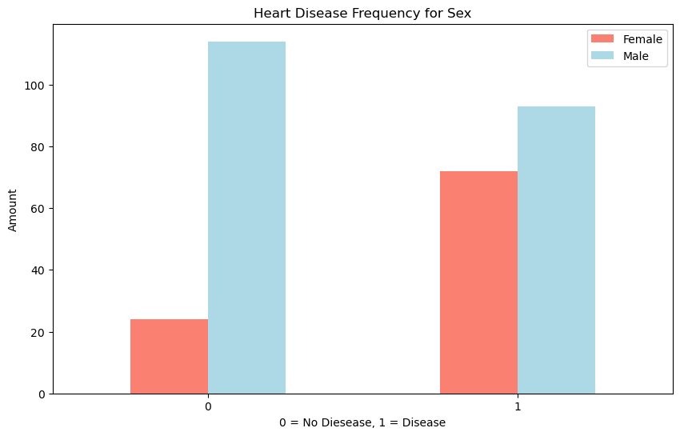
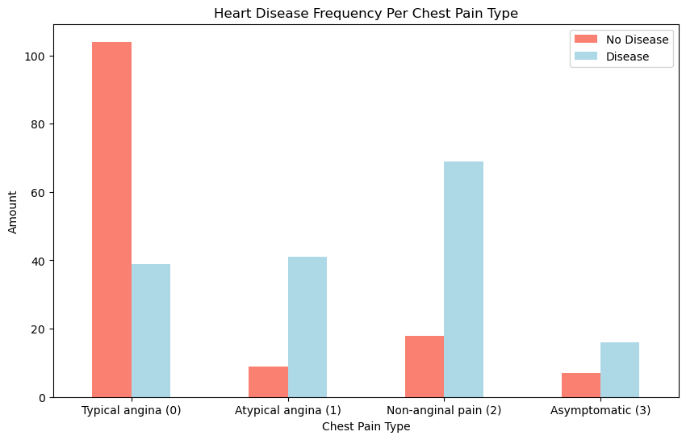
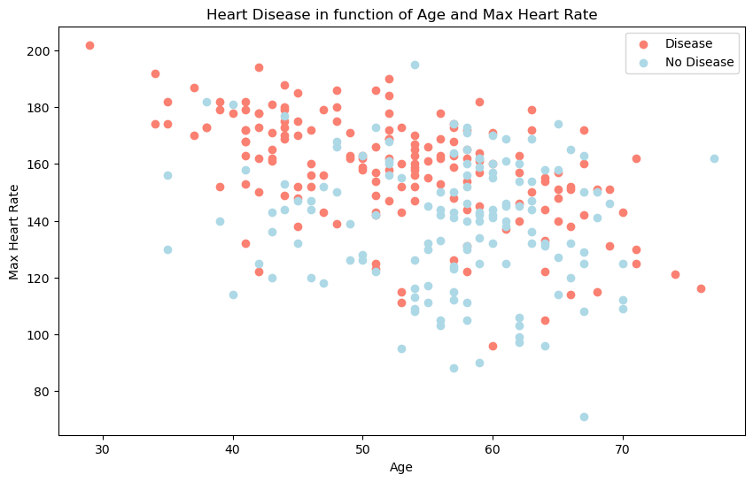
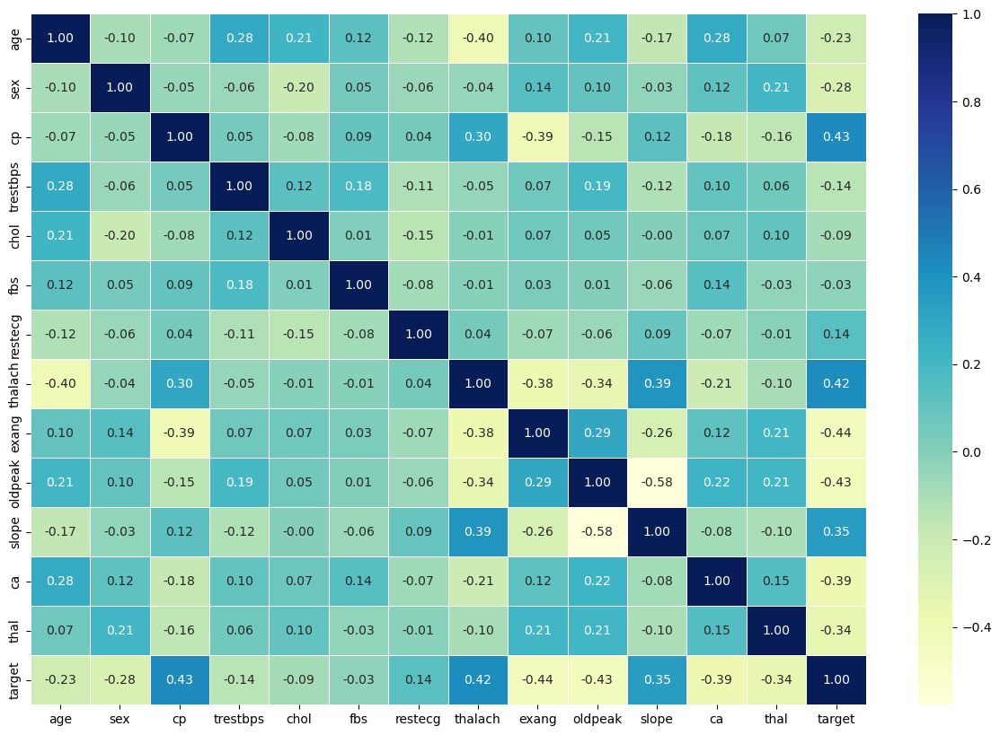
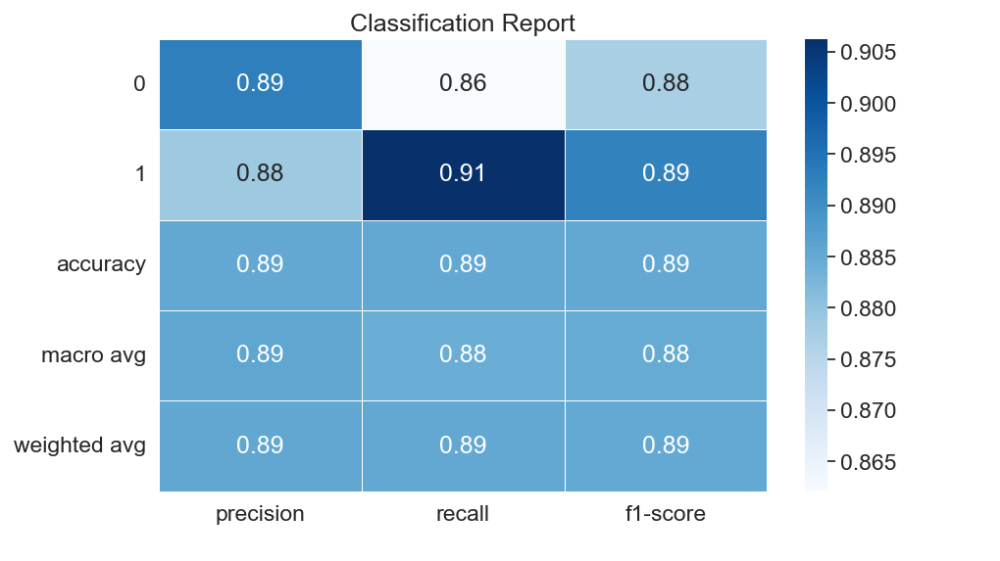
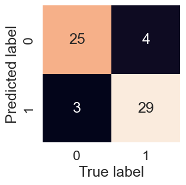
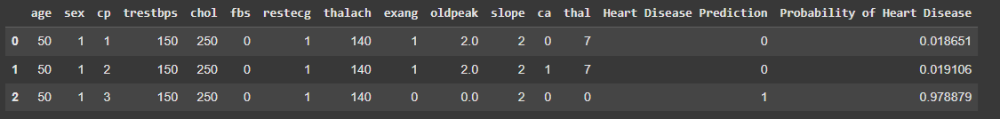
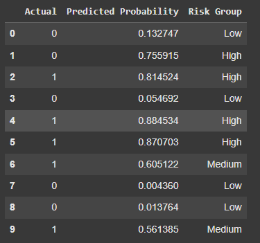
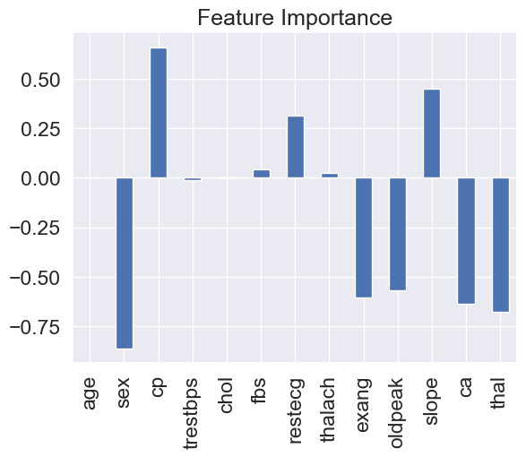
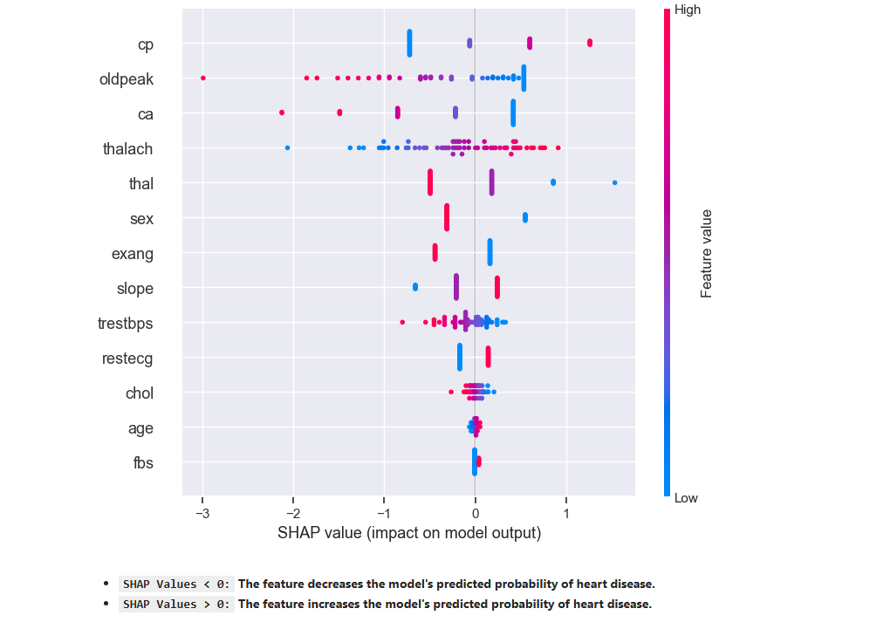

# Heart Disease Prediction Showcase

``` {important}
This showcase presents the key visualizations and insights from the Heart Disease Prediction Project. The goal is to highlight the most important findings without diving into detailed code.

starting with patterns observed in the data and then explaining how machine learning helps improve our understanding and predictions.
```

## Initial Patterns in the Data

### 1. Heart Disease Frequency According to Sex


*Description*: This bar plot shows the frequency of heart disease among males and females. Males have a higher incidence of heart disease compared to females.

### 2. Heart Disease Frequency per Chest Pain Type


*Description*: This plot illustrates the distribution of heart disease across different chest pain types:
- **0: Typical angina** – Chest pain related to decreased blood supply to the heart.
- **1: Atypical angina** – Chest pain not related to the heart.
- **2: Non-anginal pain** – Typically esophageal spasms, not heart-related.
- **3: Asymptomatic** – Chest pain without showing signs of disease.
  
*Insight*: Patients with asymptomatic chest pain (type 3) show the highest frequency of heart disease.

### 3. Age vs. Max Heart Rate for Heart Disease


*Description*: This scatter plot examines the relationship between age and maximum heart rate, distinguishing patients with and without heart disease. Unlike the previous clear patterns, this relationship is less straightforward, demonstrating the complexity that machine learning models can help unravel.

## Data Visualizations and Insights

### 1. Correlation Matrix


*Description*: The heatmap illustrates relationships between features, helping identify variables that are strongly correlated. It gives a first impression of which features might be important for predicting heart disease.

### 2. Model Performance Metrics

#### Classification Report


*Description*: The classification report provides precision, recall, and F1-score for each class. It offers a summary of the model's performance, highlighting how well the model differentiates between patients with and without heart disease.

**`Precision`**: Precision measures the accuracy of positive predictions. It tells you, out of all instances predicted as a certain class (0 or 1 here), how many were actually correct. `High precision means a low false positive rate` (in the confusion matrix).

**`Recall`**: It tells you, out of all the actual instances of a class, how many were correctly predicted. `High recall means a low false negative rate.`

**`F1-score:`** The F1-score is the harmonic mean of precision and recall. It provides a balance between the two

**`Support`**: Support represents the actual number of occurrences of each class in the y_test dataset. It indicates how many instances of each class were used to calculate the precision, recall, and F1-score for that class.

**`Accuracy`**: The overall accuracy of the model, which represents the percentage of correct predictions out of all predictions.(the defualt of using score()).

**`Macro avg`**: This is the average of precision, recall, and F1-score for both classes (0 and 1), calculated without considering class imbalance. It is a simple average.

**`Weighted avg`**: This is the average of precision, recall, and F1-score for both classes, weighted by the support (number of instances) for each class.

#### Confusion Matrix


*Description*: The confusion matrix visualizes the model's predictions compared to the actual outcomes. It helps identify where the model is making correct predictions and where it may be misclassifying patients.

### 3. Probability-Based Insights

#### Predict on a Range of Hypothetical Patients


*Description*: This visualization shows the model’s predictions for a range of hypothetical patients. It provides a probability score for each patient, indicating the likelihood of having heart disease. This helps to understand how the model assesses risk based on different combinations of features.

#### Risk Group Segmentation


*Description*: This chart segments patients into risk groups (e.g., Low, Medium, High) based on their predicted probabilities of heart disease. It helps to categorize patients and prioritize those who may need further medical attention.

### 4. Feature Importance Plot


*Description*: This plot highlights the features that most influence the model's predictions. Chest pain type (`cp`) and `oldpeak` are among the most significant predictors.

### 5. SHAP Summary Plot


*Description*: The SHAP plot provides a detailed view of how individual features impact model predictions, with red indicating an increase in the likelihood of heart disease and blue indicating a decrease.

* **`SHAP Values < 0:` The feature decreases the model's predicted probability of heart disease.**
* **`SHAP Values > 0:` The feature increases the model's predicted probability of heart disease.**

* `Red: High feature value`
* `Blue: Low feature value`

## Conclusion
The initial patterns in the data give us some insights, but the relationships are often complex and not easily interpretable. By leveraging machine learning and interpretability techniques, we can better understand the underlying factors contributing to heart disease risk.

```{tableofcontents}
```
