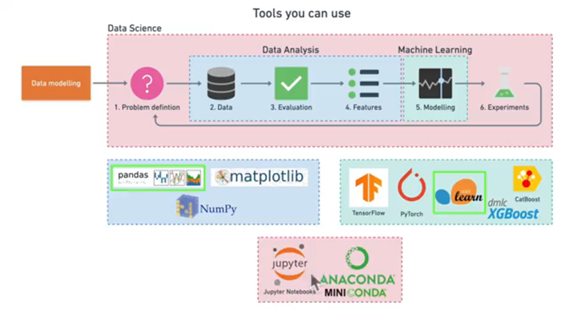

# Software Design
This project is organized into a comprehensive data science workflow consisting of six steps:



## 1. Problem Definition
- The goal is to predict the likelihood of a patient having heart disease using their medical data.
- This problem falls under **Supervised Learning** with **structured data** and focuses on **classification** since we are predicting a binary outcome (presence or absence of heart disease).

## 2. Data Collection
- What data do we have? How does it match the problem definition? Is it structured or unstructured? Static or streaming?
- The dataset used includes patient information such as age, sex, cholesterol levels, and other key medical indicators.

## 3. Evaluation
- What defines success?

## 4. Feature Engineering
What parts of the data are we going to use for the model? How can existing knowledge influence this?
- The goal here is to find out more about the data and become a subject matter export on the dataset you're working with.
    * What question(s) are you trying to solve?
    * What kind of data do we have and how do we treat different types?
    * What's missing from the data and how do you deal with it?
    * Where are the outliers and why should you care about them?
    * How can you add, change or remove features to get more out of your data?

## 5. Modeling and Evaluation
Which model should you choose? How can you improve it? How do you compare it with others?
- Various machine learning models were tested, including **Logistic Regression**, **Random Forest**, and **XGBoost**.
- The models were evaluated using metrics like **precision**, **recall**, **F1-score**, and a detailed **confusion matrix**.
- Cross-validation techniques were employed to ensure the model's robustness.
- GridSearchCV was used after RandomizedSearchCV for fine-tuning hyperparameters.
- **Logistic Regression** emerged as the top performer with an accuracy score of 88%, achieved after extensive hyperparameter tuning using GridSearchCV.

## 6. Experimentation 
What else could be tried? Does the deployed model perform as we want?
* Could I collect more data?
* Could I try a better model? Like CatBoost or XGBoost?
* Could I improve the current models? (beyond what we've done so far)


## Software Design Consideration
The project follows a **machine learning pipeline design**, which is commonly used in data science projects. It consists of:
- **Data Preprocessing**: Handling missing values, encoding categorical variables, and feature scaling.
- **Model Selection and Tuning**: Using techniques like cross-validation and hyperparameter optimization.

This systematic approach ensures that the model is well-tuned and reliable for predictions.

---

### Explanation of Supervised Learning and Classification
In the **Problem Definition** section:
- **Supervised Learning**: The model is trained on labeled data, meaning we have input features (`X`) and corresponding output labels (`y`).
- **Classification**: The task is to categorize patients into two groups: those with and without heart disease.
  
## Future Work
- Explore more complex models like **neural networks** or implement real-time predictions.
- Consider adding additional medical data for a more robust model.
  
```{tableofcontents}
```
